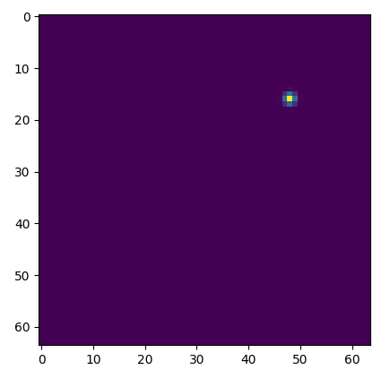
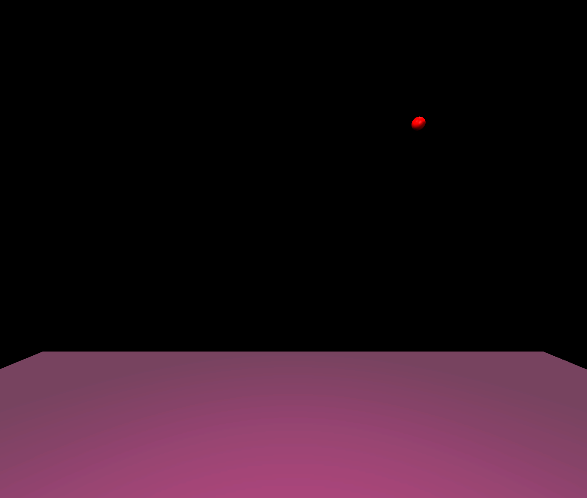
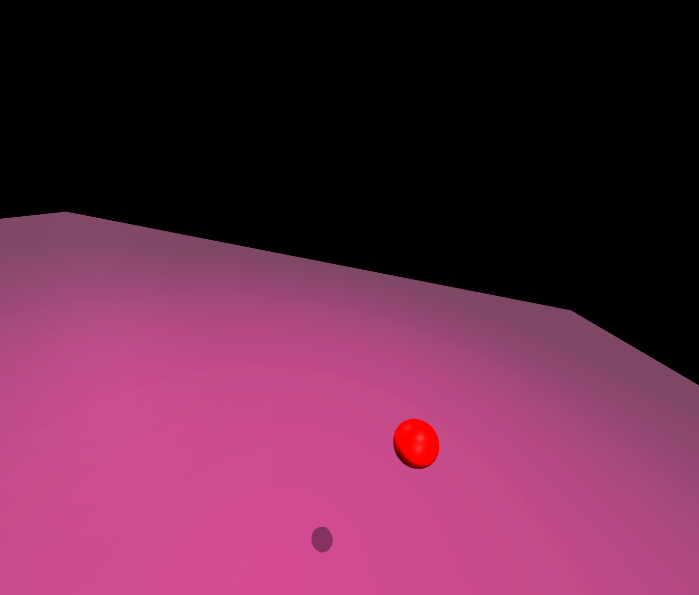

# 2D Projection from 3D in MuJoCo simulator

## The problem to implement a 2D mapping using the data from the MuJoCo simulator. 

This is the script to project the object position in Mujoco to it's camera space.

Theoretically, it shouldn't be that difficult because there is a equation to do this. ([Math Formula](https://en.wikipedia.org/wiki/3D_projection#Mathematical_formula))

However the thing is not that easy because MuJoCo uses different coordinate system than the normal computer vision practice.

| Direction in the camera space | CV coord. | MuJoCo coord. |
|-------------------------------|:---------:|:-------------:|
|               Up              |     x     |       y       |
|             Right             |     y     |       x       |
|  Forward  (Camera direction)  |     z     |       -z      |

By using our code, you can input the position of object and camera directly from MuJoCo and generate the 2D projection in the camera space.

In order to get the position and orientation of object and camera, use mujoco-py API's as follows.

* Object position: `env.sim.data.get_geom_xpos("object")`
* Camera position: `env.sim.data.get_camera_xpos('camera1')`
* Camera orientation (euler) `gym.envs.robotics.rotations.mat2euler(env.sim.data.get_camera_xmat('camera1'))`       

## Example #1

Input:

object position [m]     : x=1.0 y=2.0 z=3.0

camera position [m]     : x=0.0 y=0.0 z=2.0

camera orientation [rad]: x=1.57 y=0.0 z=0.0

field of view (fov) [degree] : 90

  
  

Left: Output of our function

Right: Actual view from camera in MuJoCo:

## Example #2

Input:

object position [m]     : x=0.2 y=0.25 z=1.0

camera position [m]     : x=0.7 y=0.0 z=1.5

camera orientation [rad]: x=0.2 y=1.2 z=1.57

field of view (fov) [degree] : 90

  
  

Left: Output of our function

Right: Actual view from camera in MuJoCo: